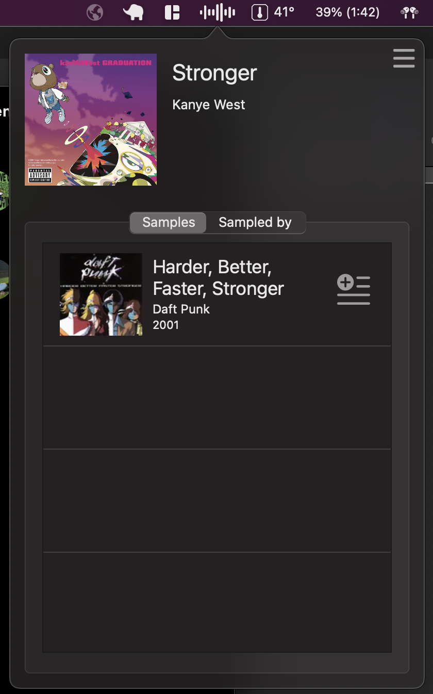

# bezola

MacOS status bar app which will show you the songs which the current song playing on Spotify samples along with the songs which sample the currently playing song.

 

Data is scraped from WhoSampled

### Running
Xcode uses the system's instance of python when executing the WhoSampled scraper, therefore make sure the required libraries are installed. The necessary libraries can be found in [requirements.txt](misc/requirements.txt)
